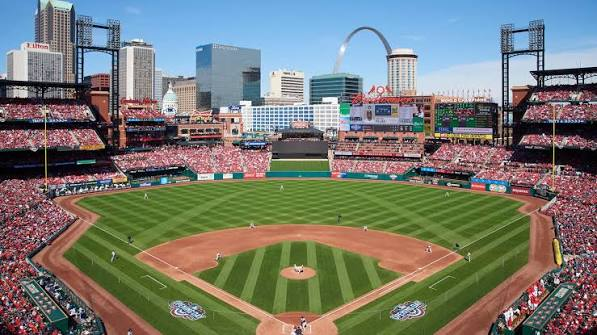

# St. Louis Cardinals - Busch Stadium
Busch Stadium opened up for the 2006 season replacing the previous Busch Stadium, this is the third one and offers great views of downtown and the Gateway Arch.  This is one of the few midwest stadiums that I haven't been to yet and is on my list to attend.

## Design and Features
* **Designed with brick and steel to give a timeless aesthetic**
* **Gate 3 has an arch entrance similar to the famous arch on the Mississippi River**
* **Massive 4,800 square-foot video board**
* **Capacity 44,383 fans**
### Team Leaders

Visit the home page [National League Central Home Page](index.md)
or individual team pages: [Chicago Cubs](chicago-cubs.md), [Milwaukee Brewers](milwaukee-brewers.md), [St. Louis Cardinals](st.-louis-cardinals.md), [Pittsburgh Pirates](pittsburgh-pirates.md), or [Cincinnati Reds](cincinnati-reds-md)
